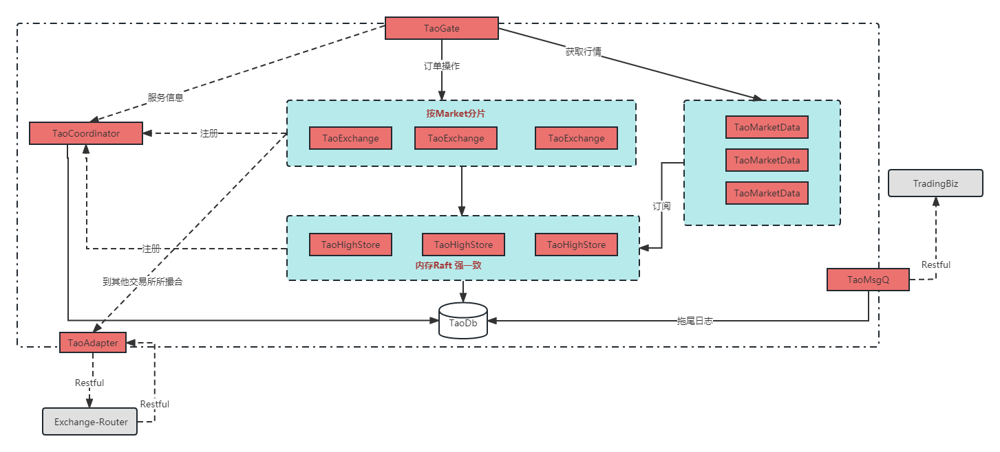

## 介绍
* coordinator: 协调者
* exchange: 撮合引擎
* gate: 撮合网关
* highStore: 高可用内存存储
* marketdata: 行情服务

## 架构图

**系统说明**

1. TaoGate：提供restful 接口
2. TaoExchange：根据Market 分片，每个分片单实例运行。
3. TaoHighStore:  存储撮合情况。
4. TaoMarketData: 行情查询系统。
5. TaoMsgQ: 采用数据库拖尾模式，提供交易情况回调，通过restful接口。
6. TaoAdapter：对于新交易所，被拒绝的订单，可以通过到第三方系统撮合。
7. Exchange-Router、TradingBiz 是外围系统，需要自己实现。
8. 该交易所 不管理用户的资产，只管理订单的撮合情况和比价。